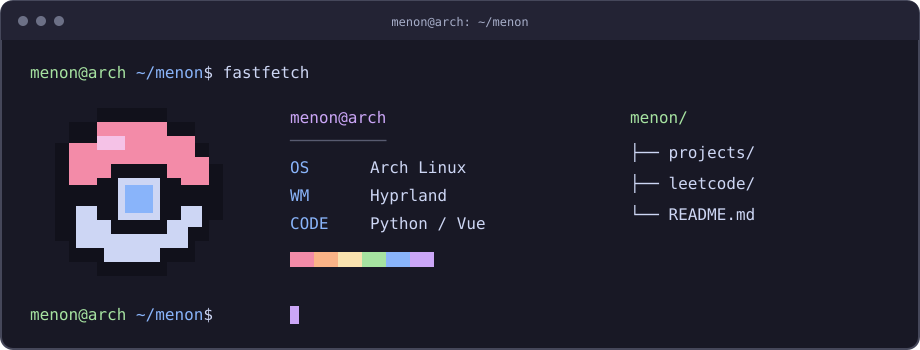

## hey, I'm Menon 👋

Python, web apps, and an Arch desktop running Hyprland.

### a little about me

```python
menon = {
    "name": "Aditya Menon",
    "code": ["Python", "JavaScript", "HTML", "CSS"],
    "tools": ["Flask", "Vue", "SQLite", "Redis", "Celery"],
    "desktop": {"os": "Arch Linux", "wm": "Hyprland"},
    "terminal_vibe": "Pokémon",
}
```

### meanwhile, in my terminal



<sub>A little illustration of my setup.</sub>

### things you'll find here

- [Trekking Manager](https://github.com/AdityaMenon-DS/trekking-management-appplication-v2) — a Flask + Vue booking app, with Redis and Celery.
- [The original version](https://github.com/AdityaMenon-DS/trekking-management-application) — built with Flask and Jinja.
- [LeetCode](https://github.com/AdityaMenon-DS/Leetcode) — my Python solutions.

---
<sub>Profile layout inspired by <a href="https://github.com/Thaiane/Thaiane">Thaiane</a>.</sub>
